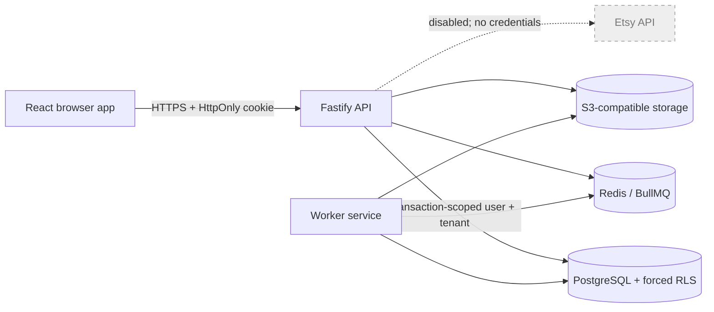

# Architecture

## Runtime topology

The web process is static and has no secrets. The API owns synchronous commands, authentication, authorization, transaction boundaries, and presigned object-storage operations. Workers handle bounded, retryable jobs. PostgreSQL is the final tenant-isolation boundary.

## Tenant isolation

Every tenant-owned record has a non-null `tenant_id` foreign key. The API begins a database transaction, sets `app.current_user_id` and `app.current_tenant_id` with transaction-local `set_config`, verifies membership, and only then runs tenant queries. `FORCE ROW LEVEL SECURITY` policies constrain reads and writes even if an application query accidentally omits its tenant predicate.

Global identity tables (`users` and `sessions`) are deliberately outside tenant RLS because one identity can belong to multiple organizations. They are never exposed by generic data routes. Membership discovery is limited by a transaction-local user context.

Runtime database credentials must inherit the non-owner `etsy_app` role. Migration credentials are separate and unavailable to runtime containers.

## Authentication

Passwords are normalized only at the email boundary and hashed with Argon2id plus a secret pepper. Login creates 256-bit random session material; only its SHA-256 digest is stored. The browser receives the opaque value in an `HttpOnly`, `SameSite=Strict` cookie that is `Secure` outside local/test environments. Unsafe browser requests are origin checked, rate limited, and CORS restricted.

This foundation uses server-side sessions so revocation is immediate and tenant membership is reloaded. Sessions expire after seven days by default.

## Jobs and object storage

BullMQ provides retry with exponential backoff, bounded retention, and independent worker scaling. Every job payload must include `tenantId`; a worker must enter the same verified tenant transaction before touching tenant data. The initial worker only demonstrates lifecycle behavior and makes no external API call.

Object keys always start with `tenants/<tenant-id>/`. The storage adapter supports AWS S3, MinIO, and other compatible systems. Presigned upload URLs expire after five minutes. Database metadata remains RLS protected.

## Health and failure behavior

- `GET /health/live` confirms the process event loop can answer and never calls dependencies.
- `GET /health/ready` checks PostgreSQL, Redis, and object storage concurrently; any failure yields HTTP 503.
- Containers stop accepting traffic before database and queue connections close.
- API requests have size and time limits; queue jobs have bounded retries.

## Environment model

The build is environment independent. Development uses Compose-provided PostgreSQL, Redis, and MinIO. Staging and production inject service addresses and secrets and run the same immutable image. `ETSY_INTEGRATION_ENABLED` is validated as the literal value `false`, causing startup to fail if someone attempts to enable it in this milestone.

## Account lifecycle

Registration atomically creates a global user identity, default tenant, owner membership, tenant settings, and audit event. Verification and password-reset tokens are random, single-use, expiring, and stored only as SHA-256 digests. Account endpoints resolve the active tenant exclusively from the authenticated server-side session and membership; browser tenant identifiers are not accepted.

The development email adapter records messages in memory and performs no network delivery. A real provider is a future gated integration. Security audit events are tenant-scoped where applicable and protected by forced RLS.
